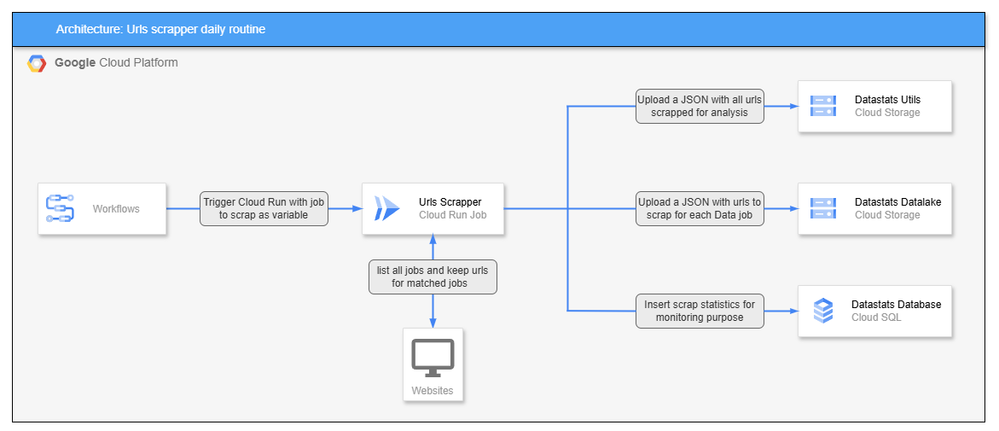

# 🚀 Datastats GCP Urls Scraper

This repository is a part of the **Datastats** x **GCP** project.


## ✨ Datastats x GCP purpose

The goal of this project is to collect daily job offers informations in data-related professions, in order to monitor market trends and the most in-demand technologies.


## 🤔 What is Urls Scrapper ?

This is a “Cloud Run Job” that executes with a job name as an input variable. It then generates a web page containing job offers for the last 24 hours in France. On each job offer, a check is made to ensure that the job name is present in the title. Each job offer that matches the job name is set aside via its url for later retrieval. 

This architecture enables the container to operate independently and autonomously, so that it can be parallelized with different job names. 


## 👷🏻‍♀️ Architecture

- A Cloud Scheduler triggers a Workflow and passes the job to scrape as an environment variable.
- The Cloud Run Job scrapes job offer websites and stores URLs in two lists: one with all scraped jobs and one with only the jobs that match the specified variable.
- The lists are stored in JSON files and uploaded to buckets according to their purpose: one will be used by another Cloud Run Job to deduplicate and retrieve job information, and the other will be analyzed at the end of the month by a Large Language Model (LLM) to add new jobs to scrape.
- Additionally, statistical data is inserted into an SQL table to monitor scraping performance.




## 📁 Repository tree

```shell
datastats-gcp-urls-scraper/
├── .github/
│   ├── dependabot.yml
│   └── workflows/
│       └── build_and_deploy.yml
├── assets/
│   └── urls_scrapper.png
├── src/
│   ├── main.py
│   └── utils/
│       ├── __init__.py
│       ├── config_loader.py
│       ├── datastats_utils.py
│       ├── gcp_utils.py
│       ├── pg_utils.py
│       ├── urls_scrapper.py
│       └── webpage_generator.py
├── .gitignore
├── .python-version
├── Dockerfile
├── pyproject.toml
├── README.md
└── uv.lock
```

## 💡 What's next ? 

Planned improvements for this repository:
- Add tests 