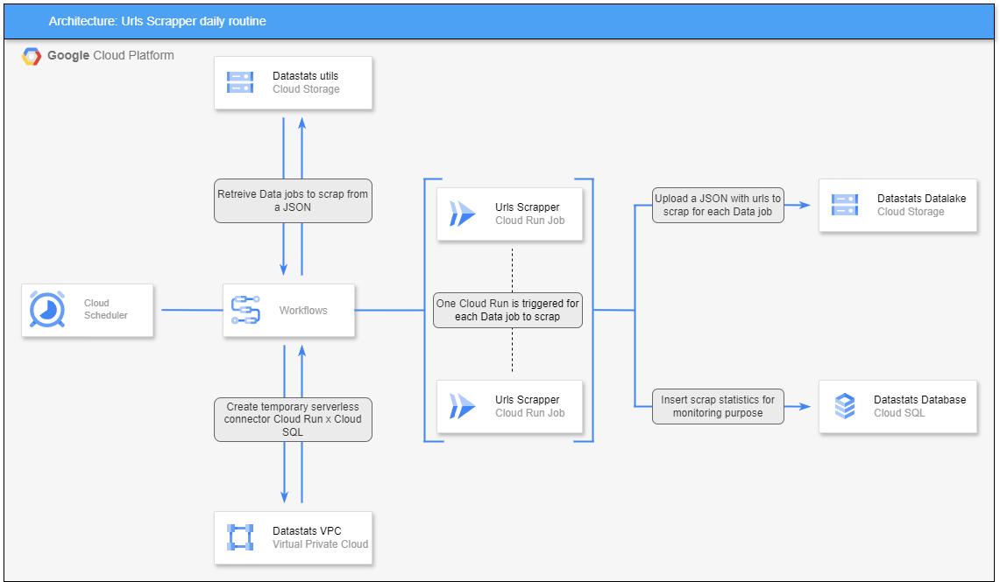

# 🚀 Urls Scraper 🚀

This repository is a part of <strong>Datastats</strong> x <strong>GCP</strong> project. 

## Datastats x GCP purpose

The aim of this project is to retrieve daily job offers in the data professions in order to monitor market trends and the technologies in demand. 

## What is Urls Scrapper ?

This is a “Cloud Run Job” that executes with a job name as an input variable. It then generates a web page containing job offers for the last 24 hours in France. On each job offer, a check is made to ensure that the job name is present in the title. Each job offer that matches the job name is set aside via its url for later retrieval. 

This architecture enables the container to operate independently and autonomously, so that it can be parallelized with different job names. 

## Architecture

Here's the architecture around this repository : 
- A Cloud Scheduler triggers a Workflow.
- The Workflow creates a Serverless Connector to allow Cloud Run Jobs to interact securely with Cloud SQL (without a public address).
- It then retrieves the jobs to scrape, and for each job, a Cloud Run instance is created.
- Each Cloud Run Job uploads a file containing URLs related to the scraped Data Job, which will be processed by another service.
- Additionally, statistical data is inserted into an SQL table to monitor scraping performance.

